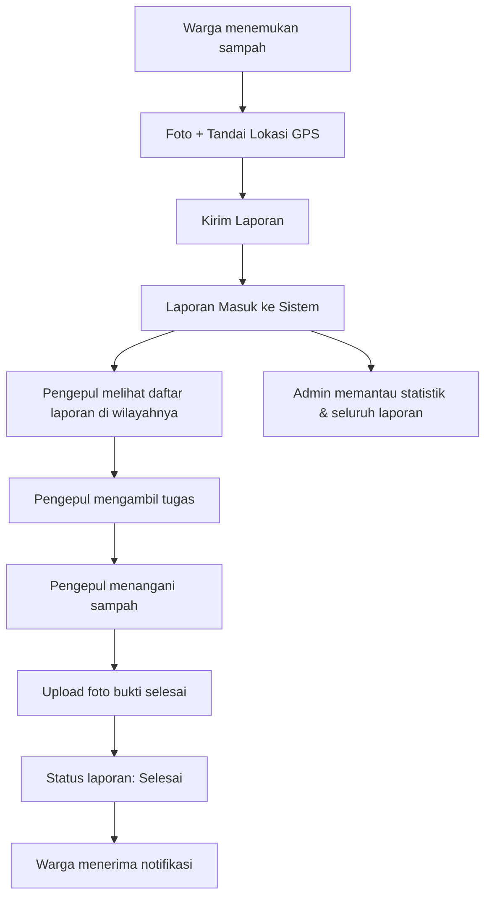

# NYAMPAH

**Aplikasi mobile pelaporan sampah untuk area yang tidak terjangkau kendaraan pengangkut sampah**

---

## 1. Latar Belakang

Di banyak wilayah perkotaan maupun pedesaan, terdapat gang-gang sempit, pemukiman padat, atau lokasi terpencil yang tidak dapat dijangkau oleh kendaraan pengangkut sampah. Akibatnya, sampah menumpuk dan menimbulkan masalah kebersihan, kesehatan, dan lingkungan.

**NYAMPAH** hadir sebagai jembatan antara warga yang menemukan tumpukan sampah di area sulit dijangkau dengan pengepul/petugas yang dapat menanganinya secara manual, dengan pengawasan dari admin.

---

## 2. Tujuan Aplikasi

- Mempermudah warga melaporkan titik sampah di lokasi yang tidak bisa diakses kendaraan.
- Mempercepat respons penanganan sampah melalui pengepul lokal.
- Memberikan data & statistik kebersihan wilayah kepada admin/pengelola.
- Mendorong partisipasi aktif masyarakat dalam menjaga kebersihan lingkungan.

---

## 3. Role Pengguna

### 3.1 Warga
| Fitur | Deskripsi |
|---|---|
| Registrasi/Login | Daftar dan masuk sebagai warga |
| Foto & Laporkan Sampah | Mengambil foto lokasi sampah beserta titik koordinat (GPS) |
| Deskripsi Laporan | Menambahkan keterangan (jenis sampah, tingkat urgensi, catatan tambahan) |
| Riwayat Laporan | Melihat status laporan yang pernah dibuat (menunggu, diproses, selesai) |
| Notifikasi | Menerima notifikasi saat laporan diverifikasi/selesai ditangani |

### 3.2 Pengepul
| Fitur | Deskripsi |
|---|---|
| Login | Masuk sebagai akun pengepul terverifikasi |
| Daftar Laporan Masuk | Melihat daftar laporan sampah di wilayah tugasnya (dengan peta lokasi) |
| Ambil Tugas | Mengklaim/menerima laporan untuk ditangani |
| Verifikasi Selesai | Mengunggah foto bukti sampah sudah diangkut/dibersihkan |
| Riwayat Penanganan | Melihat rekap tugas yang telah diselesaikan |

### 3.3 Admin
| Fitur | Deskripsi |
|---|---|
| Dashboard Statistik | Melihat jumlah laporan, status penanganan, wilayah rawan sampah |
| Manajemen Akun | Mengelola akun warga & pengepul (aktivasi, suspend, verifikasi) |
| Manajemen Laporan | Memantau seluruh laporan, dapat menugaskan ulang jika diperlukan |
| Laporan & Ekspor Data | Mengunduh data statistik (harian/bulanan) untuk evaluasi |

---

## 4. Alur Penggunaan (User Flow)

---

## 5. Struktur Data (Contoh Sederhana)

### Entitas Utama
- **User**: id, nama, email, no_hp, role (warga/pengepul/admin), status_akun
- **Laporan**: id, id_pelapor, foto_laporan, lokasi (lat, long), deskripsi, status (menunggu/diproses/selesai), waktu_lapor
- **Penanganan**: id, id_laporan, id_pengepul, foto_bukti, waktu_selesai
- **Statistik**: total_laporan, laporan_selesai, laporan_pending, wilayah_terbanyak

---

## 6. Status Laporan

| Status | Keterangan |
|---|---|
| 🟡 Menunggu | Laporan baru, belum diambil pengepul |
| 🔵 Diproses | Sedang ditangani oleh pengepul |
| 🟢 Selesai | Sudah diverifikasi selesai ditangani |
| 🔴 Ditolak | Laporan tidak valid/duplikat (opsional, oleh admin) |

---

## 7. Fitur Tambahan (Opsional / Pengembangan Lanjutan)

- Peta sebaran titik sampah (heatmap area rawan)
- Sistem poin/reward untuk warga yang aktif melapor
- Chat/komunikasi antara warga dan pengepul
- Estimasi waktu penanganan
- Integrasi dengan layanan kebersihan/dinas lingkungan setempat

---

## 8. Rekomendasi Teknologi (Opsional)

| Komponen | Pilihan |
|---|---|
| Frontend Mobile | Flutter / React Native |
| Backend | Node.js (Express) / Laravel / Django |
| Database | PostgreSQL / MySQL + PostGIS untuk data lokasi |
| Penyimpanan Foto | Firebase Storage / AWS S3 |
| Peta & Lokasi | Google Maps API / OpenStreetMap |
| Notifikasi | Firebase Cloud Messaging (FCM) |

---

## 9. Ringkasan

**NYAMPAH** dirancang sebagai solusi kolaboratif berbasis komunitas untuk mengatasi masalah sampah di area yang sulit dijangkau kendaraan pengangkut, dengan tiga peran utama yang saling terhubung: **warga** sebagai pelapor, **pengepul** sebagai eksekutor lapangan, dan **admin** sebagai pengawas & pengelola data.
